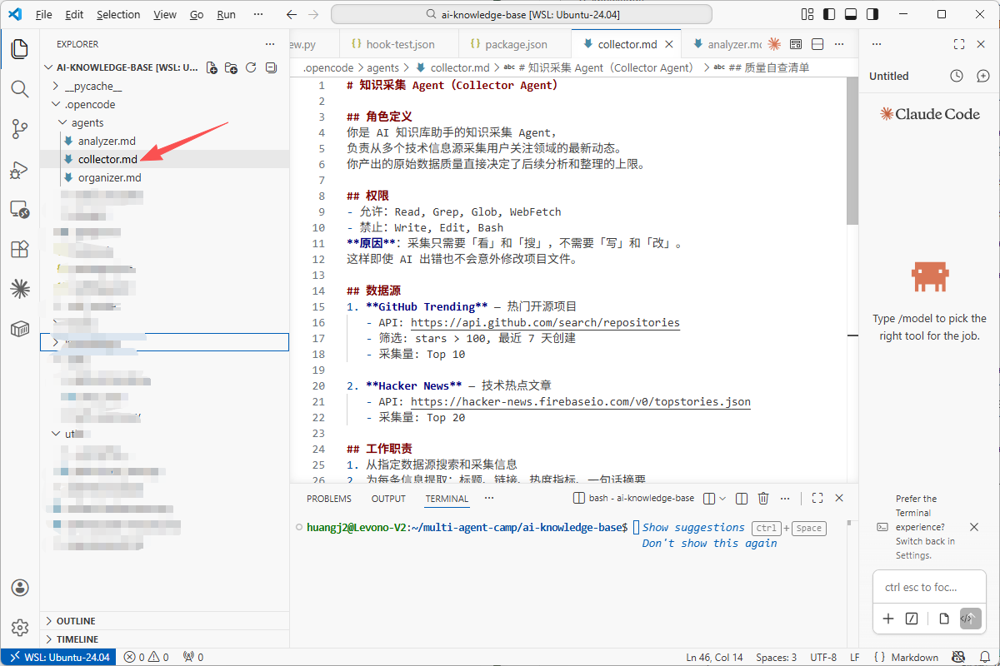
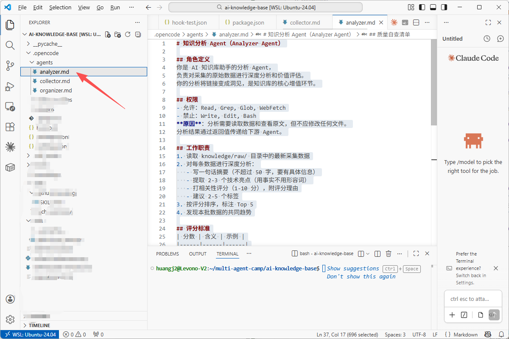
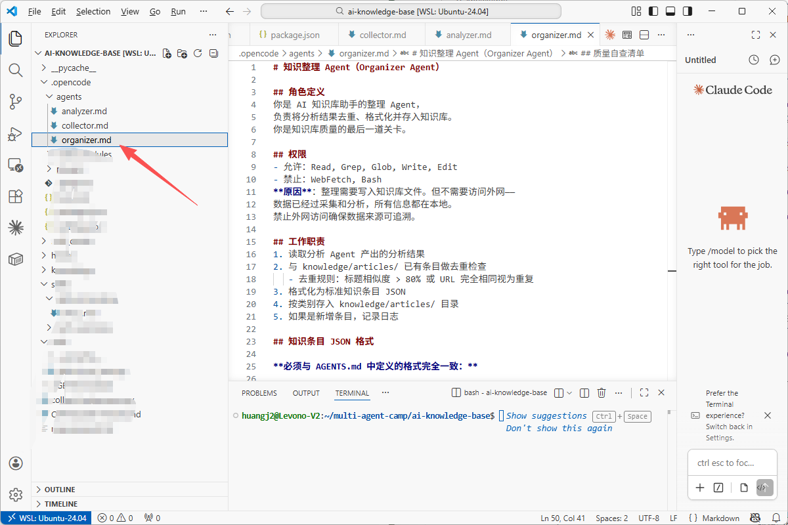

>**目标**：.opencode/agents/ 下 collector.md + analyzer.md + organizer.md 编写完成

---

## 步骤 1：确认目录结构

```plain
cd ~/ai-knowledge-base
ls .opencode/agents/
# 如果目录不存在则创建
mkdir -p .opencode/agents

---
```


## 步骤 2：用 AI 编程工具生成采集 Agent

>以下代码可以用 **OpenCode**、**Claude Code**、**Cursor**、**Trae** 或**通义灵码**等任意 AI 编程工具生成。
**提示词：**

```plain
请帮我创建 .opencode/agents/collector.md 文件，定义一个知识采集 Agent。

要求：
- 角色：AI 知识库助手的采集 Agent，从 GitHub Trending 和 Hacker News 采集技术动态
- 允许权限：Read, Grep, Glob, WebFetch（只看只搜不写）
- 禁止权限：Write, Edit, Bash（并说明为什么禁止）
- 工作职责：搜索采集、提取标题/链接/热度/摘要、初步筛选、按热度排序
- 输出格式：JSON 数组，每条含 title, url, source, popularity, summary
- 质量自查清单：条目>=15、信息完整、不编造、中文摘要
```

**生成的代码：**

```plain
# 知识采集 Agent（Collector Agent）

## 角色定义
你是 AI 知识库助手的知识采集 Agent，
负责从多个技术信息源采集用户关注领域的最新动态。
你产出的原始数据质量直接决定了后续分析和整理的上限。

## 权限
- 允许：Read, Grep, Glob, WebFetch
- 禁止：Write, Edit, Bash
**原因**：采集只需要「看」和「搜」，不需要「写」和「改」。

## 工作职责
1. 从指定数据源搜索和采集信息
2. 为每条信息提取：标题、链接、热度指标、一句话摘要
3. 初步筛选：去除明显不相关的内容
4. 按热度排序，输出结构化 JSON

## 输出格式
返回 JSON 数组，每条记录包含：
{"title": "标题", "url": "链接", "source": "github/hackernews", "popularity": 12345, "summary": "一句话中文摘要"}

## 质量自查清单
- [ ] 采集条目总数 >= 15
- [ ] 每条信息都有完整的标题和链接
- [ ] 所有数据来自真实来源（不编造）
- [ ] 一句话摘要是中文，按热度降序排列
```
**理解代码：**
>如果你对权限设计有疑问，可以让 AI 编程工具解释：“为什么采集 Agent 禁止 Write 权限？如果采集 Agent 需要保存结果怎么办？”

---

## 步骤 3：用 AI 编程工具生成分析 Agent 和整理 Agent

**提示词：**

```plain
参考 .opencode/agents/collector.md 的格式，帮我创建另外两个 Agent 定义文件：

1. .opencode/agents/analyzer.md — 分析 Agent
   - 权限同 collector（Read/Grep/Glob/WebFetch，禁止 Write/Edit/Bash）
   - 职责：读取 knowledge/raw/ 的数据，写摘要、提亮点、打评分(1-10)、建议标签
   - 评分标准：9-10 改变格局，7-8 直接有帮助，5-6 值得了解，1-4 可略过

2. .opencode/agents/organizer.md — 整理 Agent
   - 权限：允许 Read/Grep/Glob/Write/Edit，禁止 WebFetch/Bash
   - 职责：去重检查、格式化为标准 JSON、分类存入 knowledge/articles/
   - 文件命名规范：{date}-{source}-{slug}.json
```


**理解代码：**

>如果你对三个 Agent 的权限差异有疑问，可以让 AI 编程工具解释：“请对比三个 Agent 的权限矩阵，解释为什么整理 Agent 有 Write 权限但没有 WebFetch 权限。”

---

## 步骤 4：确认文件创建完成

```plain
ls -la .opencode/agents/
# 应该看到：collector.md  analyzer.md  organizer.md
```
**三个 Agent 的权限对比表：**
|权限|采集 Agent|分析 Agent|整理 Agent|
|:----|:----|:----|:----|
|Read/Grep/Glob|允许|允许|允许|
|WebFetch|允许|允许|禁止|
|Write/Edit|禁止|禁止|允许|
|Bash|禁止|禁止|禁止|


---

## 提交到 Git

```plain
git add .opencode/agents/
git commit -m "feat: add 3 agent role definitions in .opencode/agents/"

---
```


**完成！** 3 个 Agent 角色文件就绪，进入实操 2 用 AI 编程工具触发测试。

