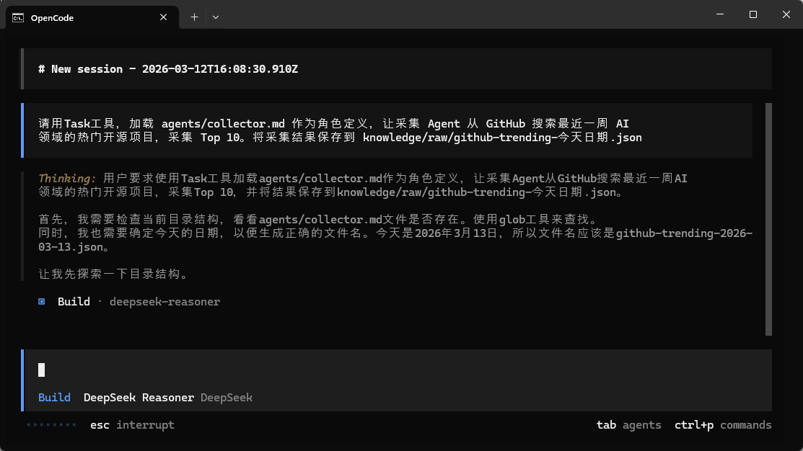
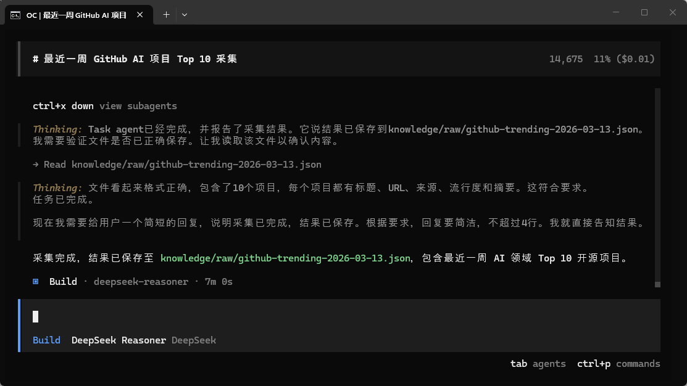
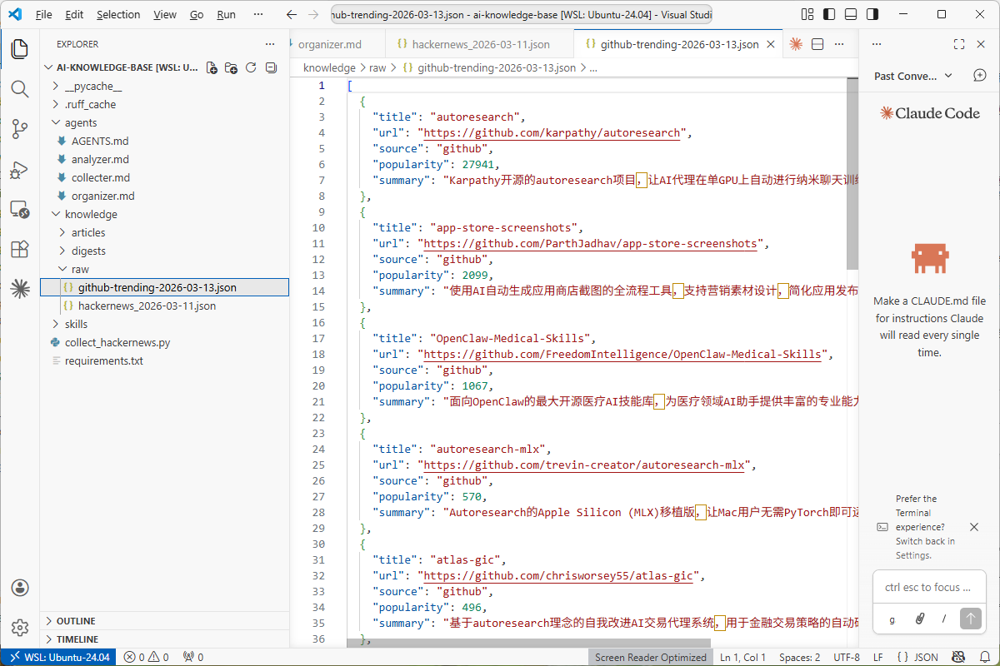
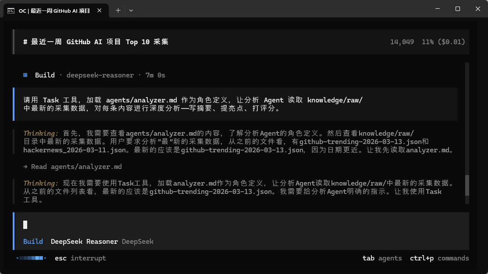
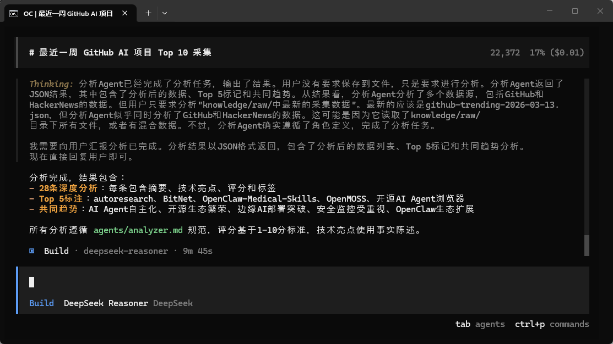
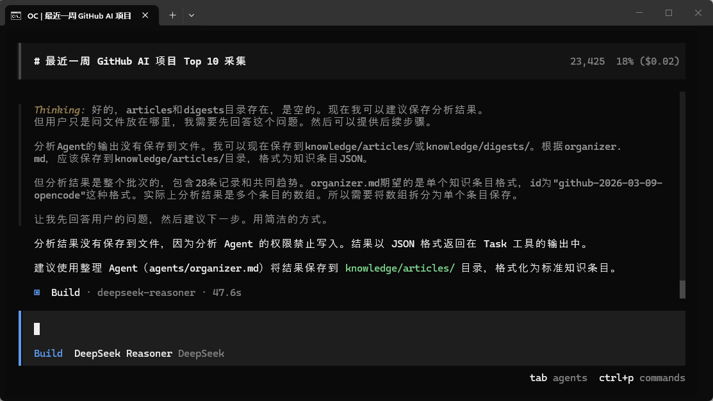
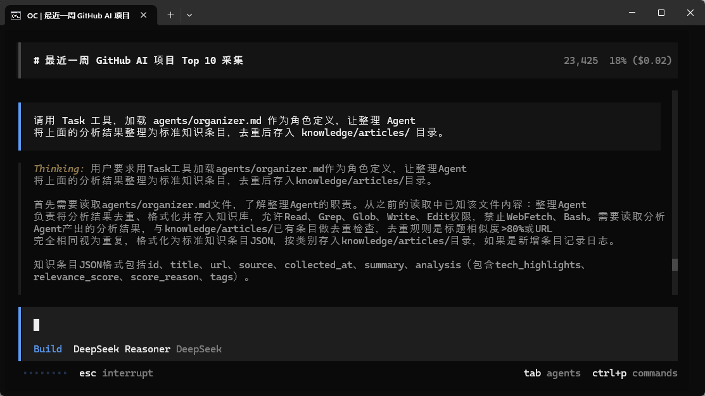
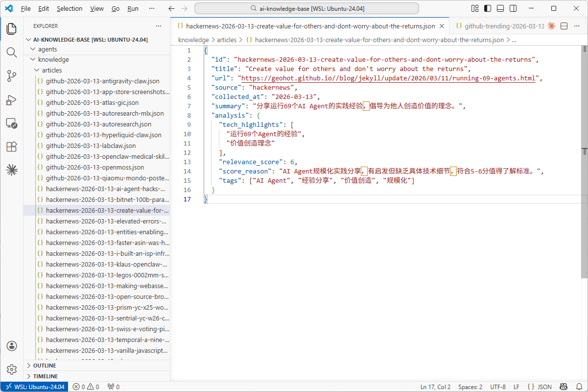

>目标：3 个 Agent 依次触发测试通过

---

## 步骤 1：用 @mention 触发采集 Agent

>以下操作可以用 **OpenCode**、**Claude Code**、**Cursor**、**Trae** 或**通义灵码**等任意 AI 编程工具完成。
```plain
cd ~/ai-knowledge-base
opencode
```
**提示词（方式 A：@mention）：**
```plain
@collector 搜集本周 AI 领域的 GitHub 热门开源项目 Top 10。
搜索完成后把 JSON 数据保存到 knowledge/raw/github-trending-今天日期.json
```
**提示词（方式 B：Task 工具委派）：**
```plain
请用 Task 工具委派一个子任务给采集 Agent：
- 读取 .opencode/agents/collector.md 作为角色定义
- 搜集本周 AI 领域的 GitHub 热门开源项目 Top 10
- 返回结构化 JSON 结果

拿到结果后，你来把数据保存到 knowledge/raw/github-trending-今天日期.json
```








>**注意**：采集 Agent 没有 Write 权限，所以由主 Agent 负责写文件。这就是角色隔离的体现。
**理解代码：**

>如果你对 @mention 和 Task 工具的区别有疑问，可以让 AI 编程工具解释： "@mention 和 Task 工具委派 Sub-Agent 有什么区别？什么时候用哪种？"

---

## 步骤 2：触发分析 Agent

**提示词：**

```plain
@analyzer 读取 knowledge/raw/ 中最新的采集数据，
对每条内容进行深度分析——写摘要、提亮点、打评分（1-10 分并附理由）。
```








**检查要点：**

|检查项|期望|
|:----|:----|
|分析Agent是否被调用|是|
|分析Agent是否直接把结果写入文件|否|
|每条是否有摘要（不超过 50 字）|是|
|是否提取了 2-3 个技术亮点|是|
|评分是否有区分度（不全是 7-8）|是|
|评分是否附有理由|是|


---

## 步骤 3：触发整理 Agent

**提示词：**

```plain
@organizer 将上面的分析结果整理为标准知识条目，
去重后存入 knowledge/articles/ 目录，每个条目单独一个 JSON 文件。
```




验证产出：


```plain
ls knowledge/articles/
python3 -c "
import json, glob
files = glob.glob('knowledge/articles/*.json')
print(f'共生成 {len(files)} 个知识条目')
for f in files[:3]:
    data = json.load(open(f))
    print(f'  - {data.get(\"title\", \"无标题\")}: 评分 {data.get(\"analysis\", {}).get(\"relevance_score\", \"无\")}')
"
```




---

## 步骤 4：记录问题和调整

**提示词：**

```plain
请帮我创建一个 sub-agent-test-log.md 文件，记录刚才三个 Agent 的测试结果：
- 每个 Agent 是否按角色定义执行
- 是否有越权行为（如采集/分析 Agent 直接写文件）
- 产出质量如何
- 需要调整的地方
```
**理解代码：**
>如果你对 Agent 的行为有疑问，可以让 AI 编程工具解释： "为什么 Agent 有时会不遵守角色定义中的权限限制？如何加强约束？"

---

## 核心收获

* **@mention** 快速切换角色，适合简单任务

* **Task 工具** 创建隔离上下文，适合复杂独立任务

* Agent 之间通过**文件**协作，不通过上下文共享


---

**完成！** 3 个 Agent 全部触发测试通过，知识库有了第一批数据。

