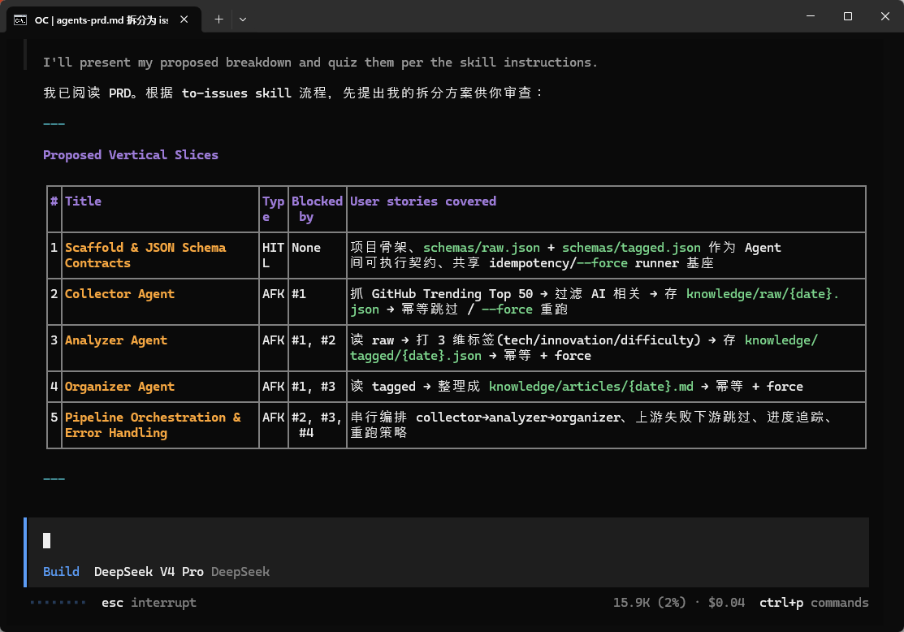
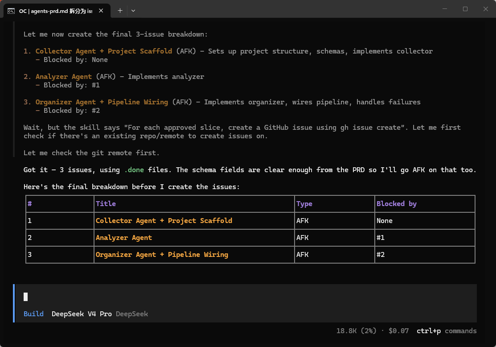
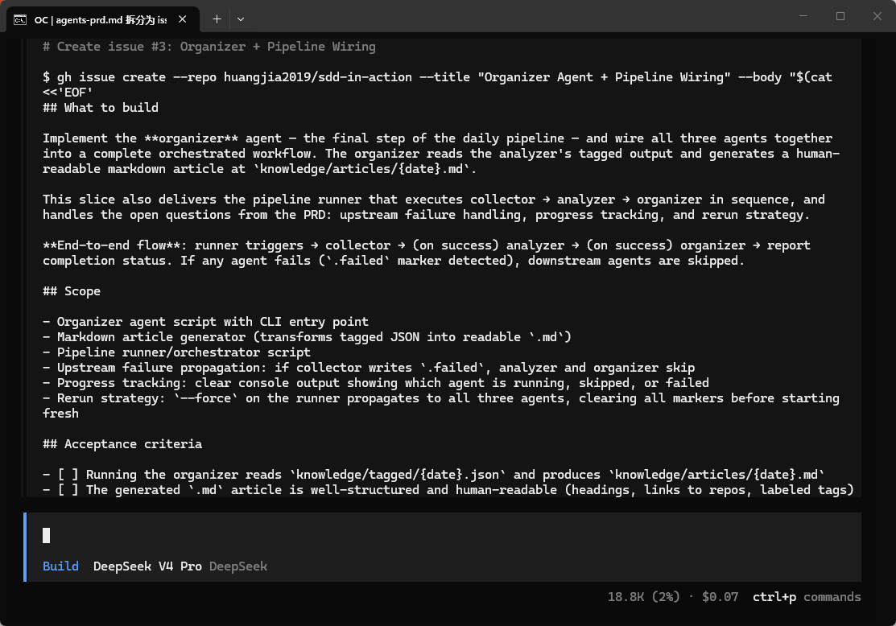
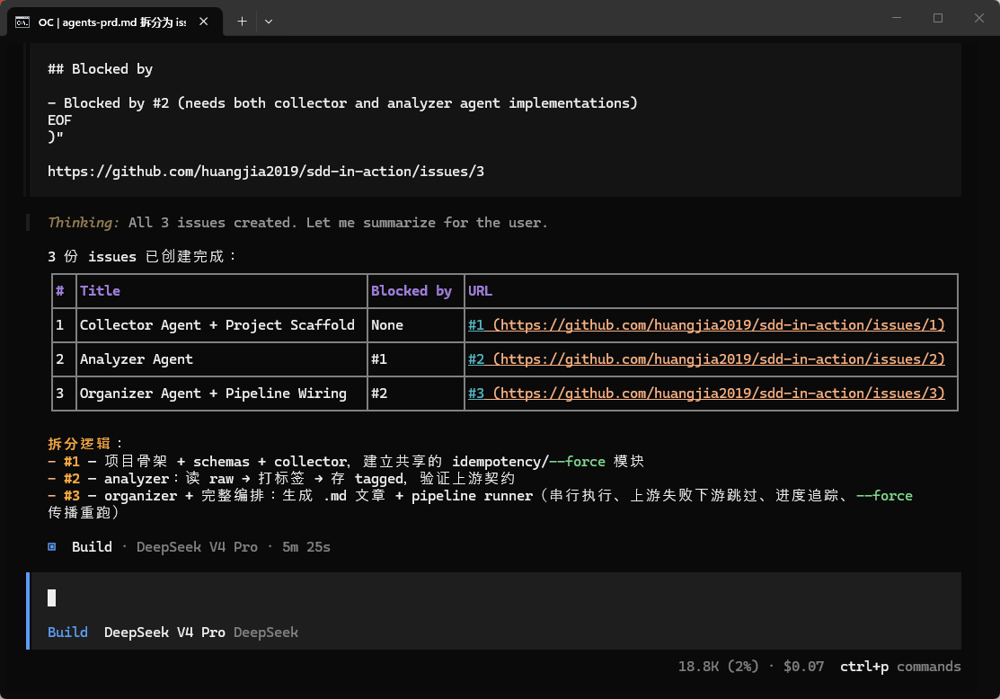

我们第一周的项目 ai-knowledge-base/v1-skeleton 有[三个 Agent](https://github.com/huangjia2019/ai-knowledge-base/tree/main/v1-skeleton/.opencode/agents)：

```plain
collector    →    analyzer    →    organizer
(采集)             (分析)              (整理)
```
当 collector 抛异常时 analyzer 怎么办？analyzer 的输出长什么样 organizer 才能读？这些是 Agent 间的依赖关系和验收标准，用自然语言提示词表达会漏，必须拆成带依赖的显式任务。

本节我们来装 Matt Pocock 的第二个 skill——**to-issues**——把高阶 PRD 展开成一组**带依赖和验收的 issue 任务票**，每个 Agent 一份。


## 预备知识

* [老项目逆向 · 改哪里 spec 补到哪里](https://github.com/huangjia2019/sdd-in-action/blob/master/week1/advance/03-%E8%80%81%E9%A1%B9%E7%9B%AE%E9%80%86%E5%90%91%E7%AD%96%E7%95%A5.md)


## 环境准备

### Claude Code

```plain
npx skills@latest add mattpocock/skills/to-issues -a claude-code
ls ~/.claude/skills/   # grill-me / to-issues 都在

```
### OpenCode（推荐）

```plain
npx skills@latest add mattpocock/skills/to-issues -a opencode
ls ~/.agents/skills/
```


## 本节目标

为 v1-skeleton 的三个 Agent 产出：

1. `specs/agents-prd.md` —— 一份**高阶 PRD**，写清 3 个 Agent 的职责和协作流

2. `specs/issues/01-collector.md` / `02-analyzer.md` / `03-organizer.md` —— 三份 **issue 任务票**，每份含 `depends_on` / `acceptance` / `schema`

3. `.opencode/agents/{collector,analyzer,organizer}.md` —— 三个 Agent 配置文件，从 issue 派生


## 双路并行

这个双路并行的设计是为了比较自己和 AI 聊和有 SDD 思想/工具做指导的差异。

### A 路 · Vibe · 10 分钟

复制下面的Prompt让AI做：

```plain
我在做 AI 知识库，有 collector / analyzer / organizer 三个 agent。
帮我写 .opencode/agents/ 下的 3 个角色定义文件。
数据流：collector 抓 GitHub Trending → analyzer 打标签 → organizer 输出 MD。
```
有什么踩坑点呢？

三个 Agent 各自知道自己要做什么，但**谁先谁后、谁触发谁、失败怎么办**都在空气里。测试时，你会发现 analyzer 在 collector 还没写完时就启动了。


### B 路 · SDD · 40 分钟

#### 阶段 1 · Specify（10 分钟）

先写一份高阶 PRD（`specs/agents-prd.md`），强制自己想清“协作”两个字：

```plain
# AI 知识库 · 三 Agent PRD v0.1

## 总流程
每天 UTC 0:00 触发 · collector → analyzer → organizer · 串行。

## Agent 职责
- collector: 抓 GitHub Trending Top 50 · 过滤 AI 相关 · 存 knowledge/raw/
- analyzer: 读 raw · 给每条打 3 维度标签
- organizer: 读已标注 · 整理成 MD

## 开放问题（? 用 to-issues 细化成任务）
- 上游失败下游怎么办？
- 数据怎么传？文件 or 消息？
- 重跑策略？
- 进度追踪？
```
这里同样故意留下几个 `?`。下阶段让 to-issues 展开成任务票。

#### 阶段 2 · Clarify（20 分钟）

to-issues 的作用不是追问（那是 grill-me），是把高阶 PRD 展开成一组带依赖和验收标准的 issue 任务票——每个 Agent 一份。


提示词：


```plain
使用 to-issues skill,基于 specs/agents-prd.md 拆成 issues。
```


**产出示例**（`specs/issues/02-analyzer.md`）：













#### 阶段 3 · Implement（10 分钟）

从 issue 派生 `.opencode/agents/{collector,analyzer,organizer}.md`——每个 Agent 配置文件直接引用对应 issue 作为职责说明。


## A vs B 对比

|维度|A 路|B 路|
|:----|:----|:----|
|耗时|10 min|40 min|
|协作依赖|口头约定|Issue 的 depends_on 字段|
|验收标准|主观判断|Issue 的 acceptance checklist|
|failure 场景|跑一次才发现|Issue 规划时就覆盖|
|新人理解成本|读 3 个文件|读 PRD + 3 份 issue|


多 Agent = 多依赖。依赖必须显式化成 issue 的 `depends_on`，验收必须显式化成 `acceptance`——**任务票才有真相源**。


## 完成清单

* `specs/agents-prd.md（高阶 PRD）`

* `specs/issues/{01-collector, 02-analyzer, 03-organizer}.md`（3 份 issue · 带 depends_on + acceptance）

* `specs/schemas/*.json`（2 份可执行 schema · 从 issue 的 acceptance 派生）

* `.opencode/agents/{collector,analyzer,organizer}.md`（从 issue 派生）


你也可以同时使用 prd-to-plan ，grill-me 的组合，提升规范质量。


## 下一节

第 4 节 Skills 能力封装 —— 三个 Agent 的骨架有了。但 collector 真正的“技能”藏在 `skills/github-trending/SKILL.md` 里。下节引入 **write-a-skill**，让 AI 用 SDD 方式帮你从零聊出一份可复用 SKILL.md。这是 Week 1 的收官节，敬请期待。

