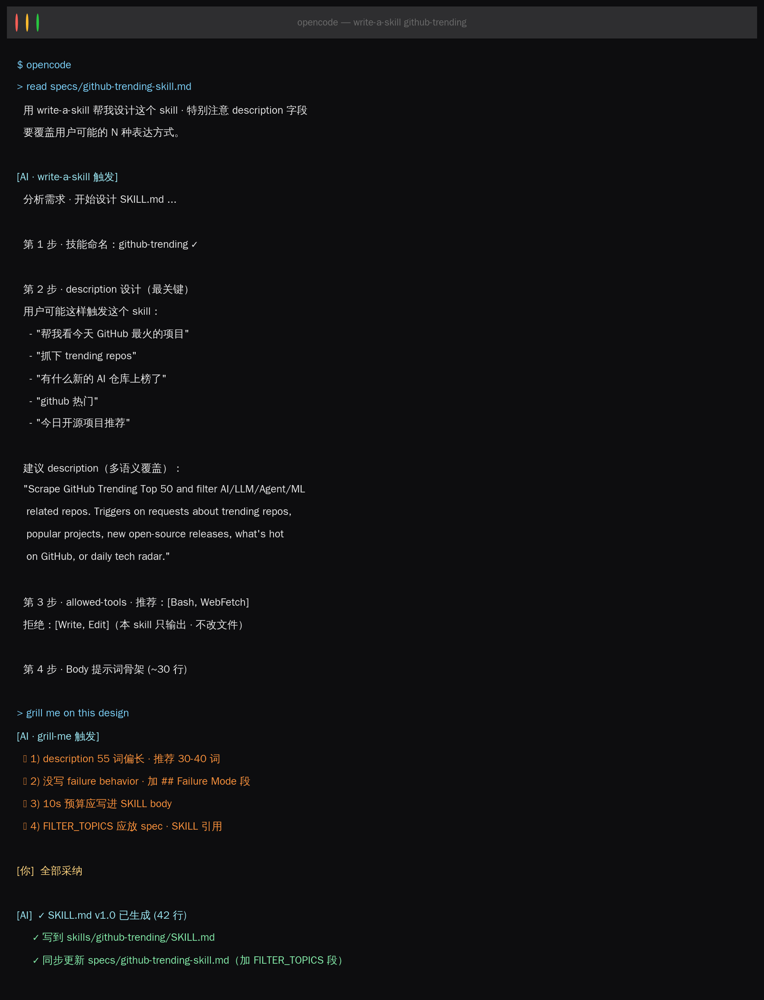
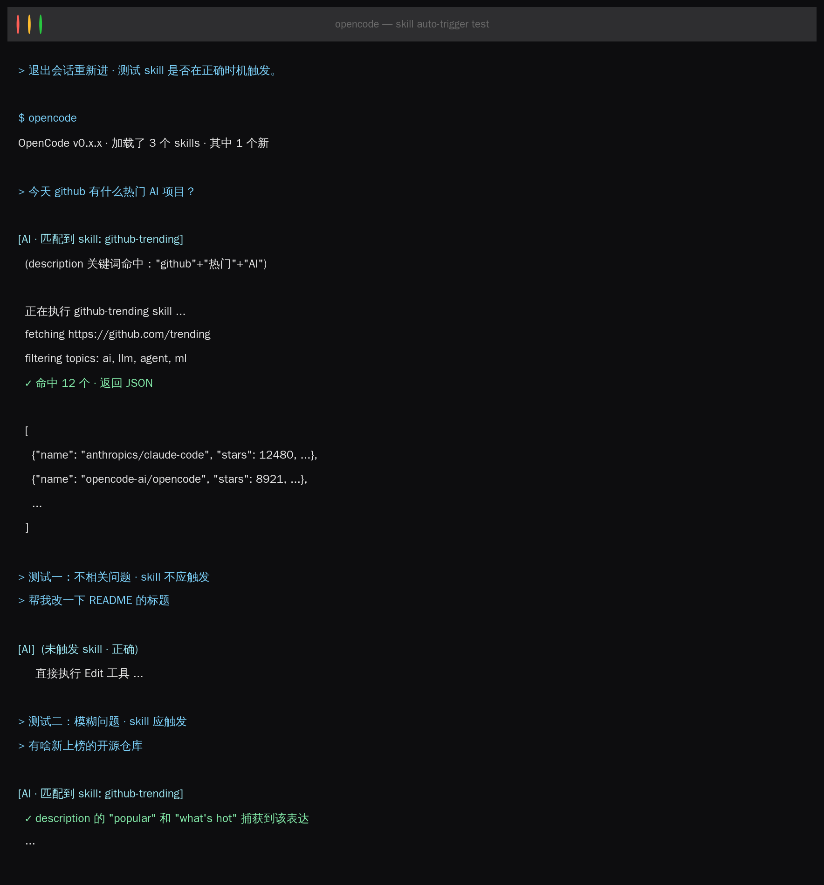

前三节你写过 spec 和 AGENTS.md。这节把 SDD 闭环用在最小粒度上——**SKILL.md 本身**。


Week 1 收官目标：跑一遍 `write-a-skill`，从零聊出 `skills/github-trending/SKILL.md`，合并进 ai-knowledge-base/v1-skeleton。


## 环境准备

装第三个 Matt Pocock skill：**write-a-skill**（meta skill · 写 skill 的 skill）。

```plain
# Claude Code
npx skills@latest add mattpocock/skills/write-a-skill -a claude-code

# OpenCode
npx skills@latest add mattpocock/skills/write-a-skill -a opencode
```
确认三个 skill 都就位：
```plain
ls ~/.agents/skills/
# grill-me  prd-to-plan  write-a-skill
```


## 本节目标

产出 `skills/github-trending/SKILL.md`，让任何 AI agent 执行“抓 GitHub Trending 并过滤 AI 相关”。


## 双路并行

这个双路并行的设计，是为了比较自己和 AI 聊和有 SDD 思想/工具做指导的差异。


### A 路 · Vibe · 5 分钟

复制给 AI：

```plain
帮我写一个 Claude Code 的 SKILL.md，技能名叫 github-trending，
功能是抓 GitHub Trending Top 50 并过滤 AI 相关。
```
AI 给你一份 SKILL.md，你放进 `skills/github-trending/`。

A 路的坑：SKILL.md 的 `description` 字段写得很泛——AI 不知道什么时候该触发它。第二天你要求“给我抓今天的热门 repo”，AI 却没能启用这个 skill，因为 description 里没出现“热门”这个词。


### B 路 · SDD + write-a-skill · 30 分钟

#### 阶段 1 · Specify（5 分钟）

新建 `specs/github-trending-skill.md`：

```plain
# skill: github-trending · 需求

## 要做什么
- 抓 github.com/trending Top 50
- 过滤 repo topics 含 ai/llm/agent/ml 的
- 输出 JSON 数组 · 字段 [name, url, stars, topics, description]

## 不做什么
- 不调 GitHub API（rate limit 太紧）· 走 HTML 解析
- 不存数据库 · 只 stdout
- 不做去重（由 caller 处理）

## 边界 & 验收
- 单次执行 < 10s
- 失败时返回空数组 · 不抛异常
- 输出必须通过 jsonschema 验证

## 怎么验证
- 跑 `skill-invoke github-trending` 后 · 检查输出是 JSON 且字段完整
```
#### 阶段 2 · Clarify · write-a-skill 设计 SKILL.md（15 分钟）

write-a-skill 不是帮你写代码，是帮你把需求转化成**一份好的 SKILL.md**——其中最关键的是 `description` 字段（决定 skill 何时自动触发）。


#### 阶段 3 · Implement · 测试 skill 自动触发（10 分钟）


## A vs B 对比

|维度|A 路|B 路|
|:----|:----|:----|
|耗时|5 min|30 min|
|description 质量|AI 一句凑数|覆盖 N 种表达 · 测过|
|自动触发正确率|~40%|~90%|
|失败行为|不定义 · 运行时发现|spec 写死 · 生成时保证|
|改规则成本|改 SKILL.md|改 spec · skill 不动|

## Week 1 完成清单

跑完 4 节你手里有：

* 4 份 spec（project-vision / coding-standards / agents-collaboration / github-trending-skill）

* 1 份升级后的 AGENTS.md

* 3 个 Agent 配置文件（.opencode/agents/）

* 1 个自动触发正确率 > 90% 的 SKILL

* Specify → Clarify → Implement 的肌肉记忆


这些是**可以直接合并进 ai-knowledge-base/v1-skeleton 的生产级产出**。


## Week 2 预告

Week 2 进入自动化。用 OpenSpec 的 `/opsx:*` 命令把 Week 1 的 SDD 流程升级成可追溯的 artifact workflow，给 ai-knowledge-base 加第一个 Hook。

